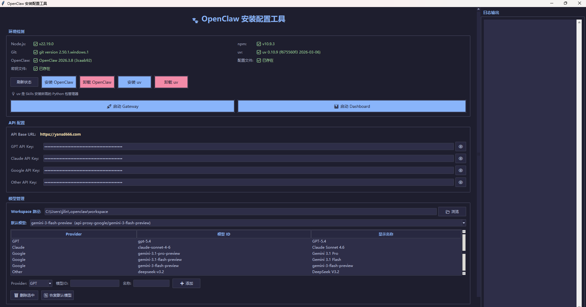

# OpenClaw 安装配置工具

一个可视化的 Windows 桌面工具，用于一键安装、配置和卸载 [OpenClaw](https://openclaw.ai/)。

## Linux 一键安装

```bash
curl -fsSL https://raw.githubusercontent.com/yansd001/openclawInstallTools/main/install.sh | bash
```

## 视频教程
👉 [点击观看 Bilibili 视频教程](https://www.bilibili.com/video/BV1RwcXzREwR)

## 软件截图



## 功能特性

### 环境检测

- 自动检测 Node.js、npm、Git、uv、OpenClaw 的安装状态及版本号
- 自动检测 `openclaw.json` 配置文件和 `auth-profiles.json` 密钥文件是否存在
- 支持手动刷新状态

### 安装

- **安装 OpenClaw** — 通过 `npm i -g openclaw` 全局安装，实时显示安装日志
- **安装 uv** — 通过 PowerShell 脚本安装 Python 包管理器 uv（Skills 安装所需）

### 卸载

- **卸载 OpenClaw** — 通过 `npm uninstall -g openclaw` 全局卸载 OpenClaw，同时删除 `~/.openclaw` 整个配置目录（含配置文件、密钥文件、agent 配置、workspace 等），操作前会弹出确认对话框
- **卸载 uv** — 优先执行 `uv self uninstall`，若失败则手动清理 uv/uvx 可执行文件及缓存数据

### API 配置

- 可视化填写四组 API Key：GPT / Claude / Google / Other
- API Key 默认遮罩显示，点击 👁 按钮切换明文/密文
- 自动读取已有的 API Key 并回填到输入框

### 模型管理

- 可视化管理模型列表（Provider、模型 ID、显示名称）
- 支持添加、删除模型，以及一键恢复默认模型列表
- 支持选择默认模型
- 支持自定义 Workspace 路径

### 配置生成

- 一键保存，自动生成 `openclaw.json` 主配置文件和 `auth-profiles.json` API 密钥文件
- 如果 Gateway 正在运行，保存配置后会自动重启 Gateway 以应用新配置

### 启动服务

- **启动 Gateway** — 在新窗口中启动 `openclaw gateway`，支持启停切换
- **启动 Dashboard** — 在新窗口中启动 `openclaw dashboard`

### 日志输出

- 右侧面板实时显示所有操作日志（安装、卸载、配置保存、服务启停等）

## 前置要求

- Windows 10/11
- [Python 3.10+](https://www.python.org/)（仅使用内置 tkinter，无需额外依赖）
- [Node.js 22+](https://nodejs.org/)（安装 OpenClaw 需要）
- [Git](https://git-scm.com/)（OpenClaw Skills 等功能需要）

## 使用方式

```bash
python main.py
```

## 工具界面说明

| 区域 | 说明 |
|------|------|
| 环境检测 | 显示 Node.js / npm / Git / uv / OpenClaw / 配置文件 / 密钥文件 的安装状态，提供安装和卸载按钮 |
| API 配置 | 填写 GPT / Claude / Google / Other 四组 API Key |
| 模型管理 | 管理模型列表、选择默认模型、设置 Workspace 路径 |
| 保存配置 | 一键保存全部配置到对应文件 |
| 启动服务 | 启停 Gateway 和 Dashboard |
| 日志输出 | 实时显示操作日志 |

## 配置文件路径

- `%USERPROFILE%\.openclaw\openclaw.json` — 主配置文件
- `%USERPROFILE%\.openclaw\agents\main\agent\auth-profiles.json` — API 密钥文件

## 项目结构

```
openclawInstallTools/
├── main.py          # 入口文件
├── gui.py           # GUI 界面模块
├── installer.py     # 安装、卸载与配置核心逻辑
└── README.md        # 本文件
```

## 捐赠支持

如果这个工具对你有帮助，欢迎请作者喝杯咖啡 ☕

| 支付宝 | 微信 |
|:---:|:---:|
|  |  |

## 参考文档

- [OpenClaw 配置教程](https://yansd.apifox.cn/8139289m0)
- [烟神殿 AI](https://yansd666.com/)
